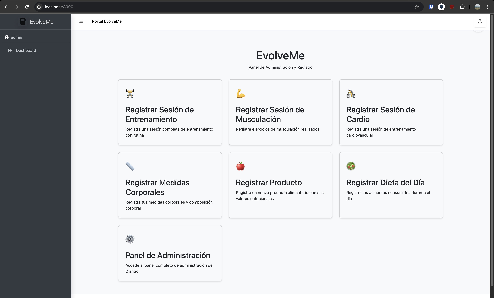
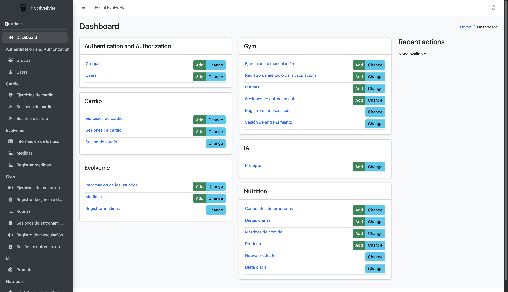
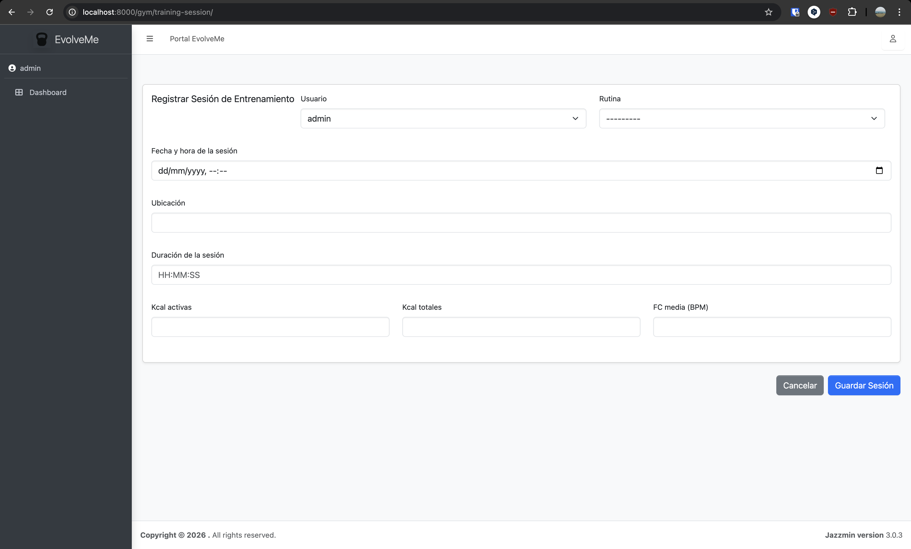
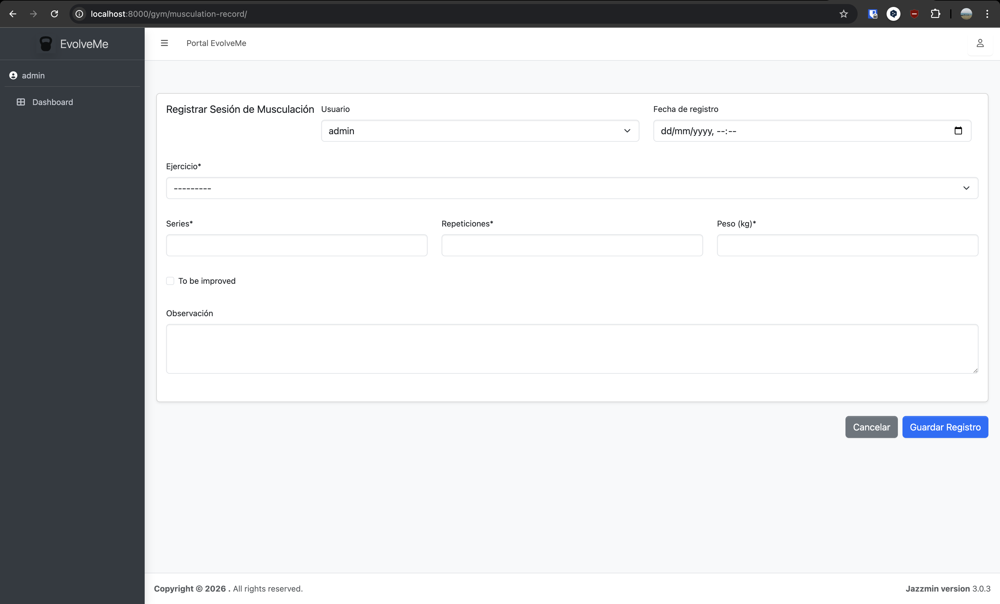
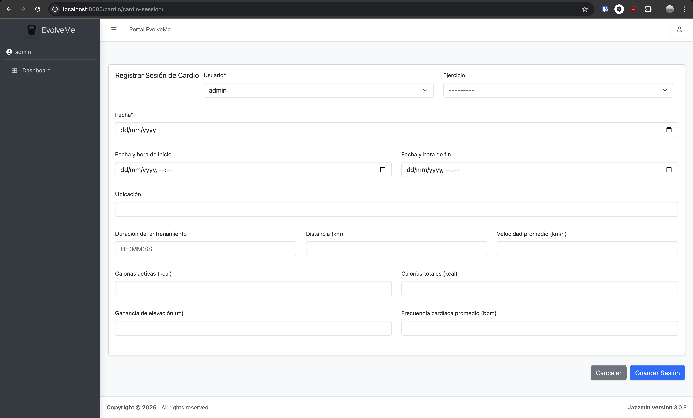
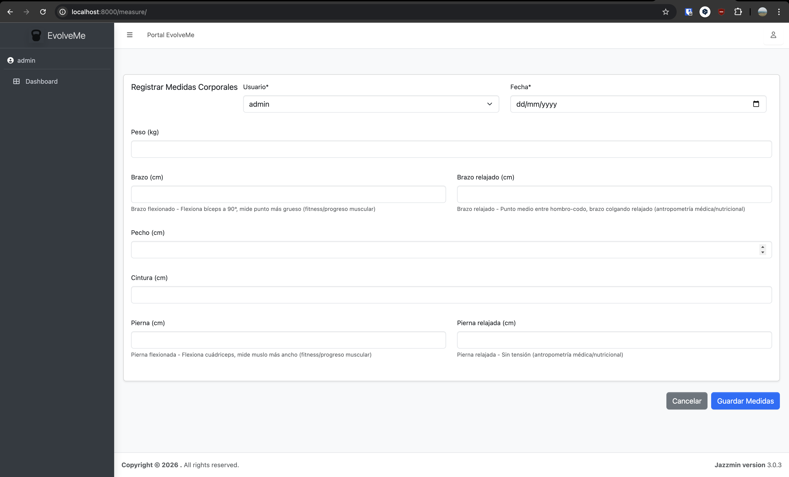
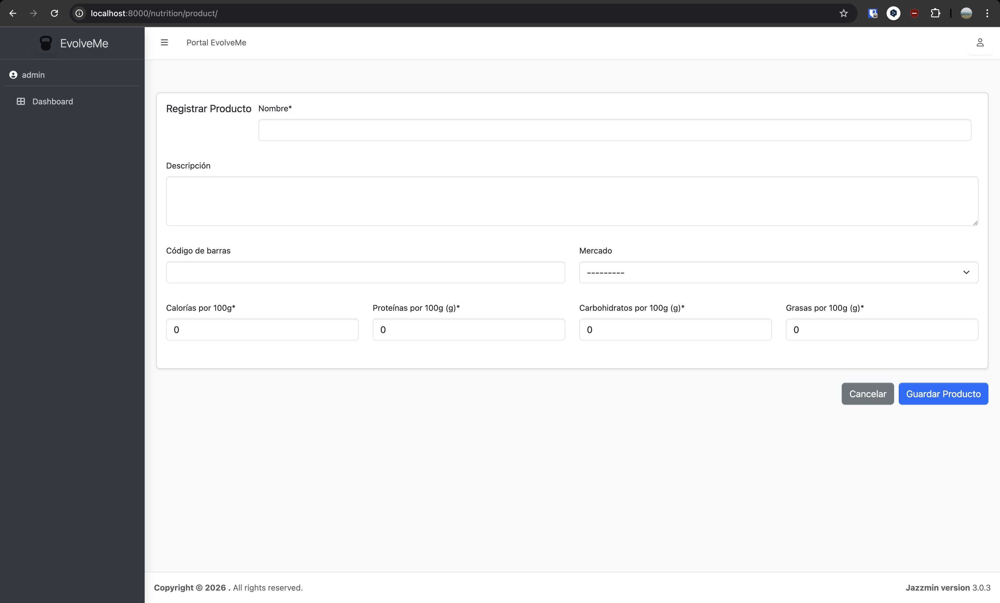
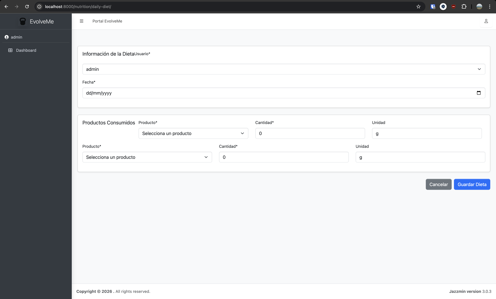

# EvolveMe - Sistema de Gestión de Fitness y Nutrición


Sistema completo de gestión para seguimiento de entrenamientos, nutrición y medidas corporales con integración de IA local (Ollama) para extracción automática de datos desde imágenes y chat con asistente.

---

## Características Principales

- **Gestión de Entrenamientos**: Rutinas de musculación, sesiones de cardio y registros de ejercicios
- **Gestión de Nutrición**: Productos alimentarios, dietas diarias y seguimiento de consumo
- **Seguimiento Corporal**: Medidas corporales y composición corporal detallada
- **Integración con IA local (Ollama)**:
  - Chat con asistente (`qwen3:8b`) sobre rutinas, nutrición y medidas
  - Extracción automática de datos desde imágenes de smartwatch/app con modelo de visión (`llama3.2-vision:11b`)
- **Admin Personalizado**: Interfaz moderna con tema Jazzmin/AdminLTE
- **Formularios Avanzados**: Formsets para entrada de datos múltiples
- **Importación de Datos**: Comandos para cargar datos desde archivos CSV

---

## URLs de Formularios Públicos

Todos los formularios requieren autenticación (`@login_required`).

### Página Principal

- **`/`** — Panel principal con tarjetas de acceso a todos los formularios

### Evolveme

- **`/measure/`** — Registrar medidas corporales (`MeasureForm`)

### Gym

- **`/gym/cardio-session/`** — Registrar sesión de cardio (`CardioSessionForm`)
  - Permite adjuntar capturas para extracción automática con IA (requiere `llama3.2-vision:11b`)
- **`/gym/musculation-record/`** — Registrar ejercicio de musculación (`MusculationRecordPublicForm`)
- **`/gym/training-session/`** — Registrar sesión de entrenamiento (`TrainingSessionModelForm`)
  - Permite adjuntar capturas para extracción automática con IA (requiere `llama3.2-vision:11b`)

### Nutrition

- **`/nutrition/product/`** — Registrar producto alimentario (`ProductForm`)
  - Permite adjuntar fotos del envase para extracción automática con IA (requiere `llama3.2-vision:11b`)
- **`/nutrition/daily-diet/`** — Registrar dieta del día (`DailyDietForm` + `ProductQuantityFormSet`)

### IA / Chat

- **`/ia/chat/`** — Chat con el asistente EvolveMe (requiere `qwen3:8b`)

### URLs del Admin

- **`/admin/`** — Panel de administración de Django
- **`/admin/gym/musculationrecord/add-formset/`** — Formset de registros de musculación
- **`/admin/gym/routine/generate-from-json/`** — Generar rutina desde JSON
- **`/admin/nutrition/dailydiet/add-formset/`** — Formset de dieta diaria
- **`/admin/nutrition/dailydiet/generate-from-json/`** — Generar dieta semanal desde JSON
- **`/admin/ia/ollamamodelconfig/<pk>/pull/`** — Descargar/actualizar un modelo Ollama

---

## Estructura del Proyecto

### Apps Instaladas

- **evolveme**: App principal — perfiles de usuario y medidas corporales
- **gym**: Gestión de cardio, musculación, rutinas y sesiones de entrenamiento (absorbe la antigua app `cardio`)
- **nutrition**: Gestión de alimentos, productos y dietas diarias
- **ia**: Integración con Ollama — servidores, modelos, chat y prompts
- **project_commands**: Comandos de gestión personalizados

---

## Apps y Modelos

### Evolveme App

**Modelos:**
- **GymUserProfile**: Perfil de usuario del gimnasio — información personal, objetivos, rutina activa, fechas de inicio/fin
- **Measure**: Medidas corporales — peso, segmentos corporales, composición corporal (grasa, músculo, agua, BMI, TMB, etc.)

**Enums:** `GenderChoices`, `ObjectiveChoices`

---

### Gym App

Unifica los modelos de cardio y musculación en una sola app.

**Modelos:**
- **CardioExercise**: Tipo de ejercicio cardiovascular (nombre, descripción)
- **CardioSession**: Sesión de cardio — ejercicio, fechas, duración, distancia, velocidad, calorías, FC, elevación, imagen asociada
- **MusculationExercise**: Ejercicio de musculación — nombre, descripción, parte del cuerpo, series/reps por defecto, imagen
- **MusculationRecord**: Registro de ejercicio — usuario, ejercicio, fecha, series, repeticiones, peso, TBI, observaciones
- **Routine**: Rutina de entrenamiento — usuario, fechas, tipos de ejercicio (JSON), calentamiento, ejercicios (ManyToMany)
- **TrainingSession**: Sesión de entrenamiento — usuario, rutina, fecha, ubicación, duración, calorías, FC media, imagen asociada

**Enums:**
- `CardioExerciseNameChoices`: Outdoor Walk, Indoor Walk, Outdoor Cycle, Indoor Cycle, Elliptical, Musculation
- `BodyPartChoices`: Pecho, Espalda, Piernas, Brazos, Hombros, Abdomen, Antebrazos, Zona media
- `ExerciseTypesChoices`: Push, Pull, Legs, Core, Full Body, Lower Body, Upper Body, Abs, Forearms
- `UnitChoices`: Repeticiones, Segundos

**Extracción con IA:**
Los formularios de cardio y entrenamiento permiten adjuntar capturas de smartwatch/app. Si `llama3.2-vision:11b` está descargado en el servidor Ollama, los campos se rellenan automáticamente. Si no está disponible, la zona de subida se reemplaza por un aviso.

---

### Nutrition App

**Modelos:**
- **Product**: Producto alimentario — nombre, descripción, código de barras, información nutricional completa por 100 g (energía, macros, fibra, sal, omega-3, micronutrientes), mercado, stock
- **ProductImage**: Imagen asociada a un producto
- **ProductQuantity**: Cantidad de producto — producto, cantidad, unidad
- **DailyDiet**: Dieta diaria — usuario, fecha, productos (ManyToMany con ProductQuantity)
- **MealMetrics**: Métricas nutricionales de una dieta

**Extracción con IA:**
El formulario de producto permite adjuntar fotos del envase o etiqueta. Si `llama3.2-vision:11b` está disponible, los valores nutricionales se extraen automáticamente (OCR). Si no, la zona de subida se reemplaza por un aviso.

---

### IA App

Gestiona la integración completa con Ollama.

**Modelos:**
- **OllamaServer**: Servidor Ollama — URL base, API key opcional, habilitado/deshabilitado
- **OllamaModelConfig**: Configuración de modelo — servidor, nombre del modelo, alias, propósito, parámetros de inferencia (temperatura, top_p, max_tokens), estado de descarga (`downloaded`, `digest`, `last_checked_at`, `update_available`)
- **Promtps**: Prompts predefinidos — nombre y contenido
- **ChatSession**: Sesión de chat — usuario, modelo usado, timestamps
- **ChatMessage**: Mensaje de chat — sesión, rol (`user`/`assistant`), contenido, timestamp

**Modelos Ollama configurados:**
| Propósito | Modelo | Variable |
|---|---|---|
| Chat con asistente | `qwen3:8b` | `CHAT_MODEL` |
| Extracción desde imagen | `llama3.2-vision:11b` | `VISION_MODEL` |

**Administración de modelos:**
- Por fila: botón "Descargar" (si no descargado) o "Actualizar" (si hay actualización disponible)
- Acción masiva: "Descargar/actualizar modelos seleccionados"

**Disponibilidad en tiempo real:**
- Chat (`/ia/chat/`): input y botón deshabilitados con aviso si `qwen3:8b` no está descargado
- Formularios de imagen: zona de subida reemplazada por aviso si `llama3.2-vision:11b` no está descargado

---

## Integración con IA

### Chat

Accede a `/ia/chat/`. El historial completo de la sesión se envía a Ollama en cada mensaje. Las sesiones se guardan en base de datos por usuario.

### Extracción desde imagen

Los servicios `extract_cardio_data_from_image`, `extract_training_session_data_from_image` y `extract_product_data_from_images` (en `gym/services.py` y `nutrition/services.py`) envían las imágenes al modelo de visión configurado en Ollama y devuelven un diccionario con los campos extraídos.

### Generación desde JSON (rutinas y dietas)

**Rutinas:**
1. Acceder a `/admin/gym/routine/generate-from-json/`
2. Pegar el JSON generado por la IA (ver `prompts/gym_response.txt`)
3. El sistema crea la rutina, los ejercicios que no existan y los asocia

**Dietas:**
1. Acceder a `/admin/nutrition/dailydiet/generate-from-json/`
2. Pegar el JSON generado por la IA (ver `prompts/nutrition_response.txt`)
3. El sistema crea las dietas diarias y los productos por comida

**Prompts disponibles:**
- `prompts/gym.txt` — genera rutinas Push-Pull-Legs
- `prompts/nutrition.txt` — genera dietas semanales personalizadas

---

## Comandos de Gestión

```bash
# Importar datos iniciales desde csv/
python manage.py import_data

# Eliminar todos los datos importados
python manage.py drop_data

# Actualizar datos existentes
python manage.py update_data
```

Los tres comandos leen desde la carpeta `csv/` del proyecto.

---

## Archivos de Datos CSV

Ubicados en `csv/`:

| Archivo | Contenido |
|---|---|
| `training_session.csv` | Sesiones de cardio y entrenamiento unificadas (columna `session_type`: `cardio` / `training`) |
| `measures.csv` | Medidas corporales |
| `musculation_exercises.csv` | Ejercicios de musculación |
| `products.csv` | Productos alimentarios |

### Esquema de `training_session.csv`

```
session_type, user, name, session_start, session_end, date, location,
workout_time, distance, avg_speed, active_calories, total_calories,
elevation_gain, average_heart_rate
```

- Filas `session_type=cardio`: datos completos de distancia, velocidad, elevación
- Filas `session_type=training`: campos de cardio vacíos; `name=Musculation`

---

## Formularios Avanzados

### Formsets

**MusculationRecordFormset** (`/admin/gym/musculationrecord/add-formset/`):
Registra múltiples ejercicios en una sesión — usuario, fecha, ejercicio, series, repeticiones, peso, TBI, observaciones.

**ProductQuantityFormSet** (`/admin/nutrition/dailydiet/add-formset/`):
Registra múltiples productos en una dieta diaria — usuario, fecha, producto, cantidad, unidad.

---

## Exportación de Datos

El proyecto usa **django-import-export**. En cada listado del admin aparece el botón **Export** para descargar datos en CSV, XLSX, JSON, etc. Disponible en todos los modelos: Evolveme, Gym, Nutrition, IA.

---

## Configuración

### Variables de Entorno

| Variable | Descripción |
|---|---|
| `ADMIN_USERNAME` | Usuario administrador |
| `ADMIN_PASSWORD` | Contraseña del administrador |
| `ADMIN_EMAIL` | Email del administrador |
| `ADMIN_GROUPS` | Grupos de usuarios (separados por comas) |

### Servidor Ollama

Configurar en el admin en **IA → Servidores Ollama**:
- URL base del servidor (p. ej. `http://localhost:11434`)
- API key (opcional)
- Marcar como habilitado

Los modelos se configuran en **IA → Modelos Ollama** y se descargan directamente desde el admin.

### Tema del Admin (Jazzmin)

Configurado en `project/settings.py` mediante `JAZZMIN_SETTINGS`. Consulta [django-jazzmin docs](https://django-jazzmin.readthedocs.io/).

### Archivos Estáticos

```python
STATIC_URL = "static/"
STATICFILES_DIRS = [BASE_DIR / "static"]
STATIC_ROOT = BASE_DIR / "staticfiles"
```

---

## Instalación y Uso

### Requisitos

- Python 3.12+
- Django 4.2.17
- PostgreSQL
- Ollama (para funciones de IA)
- Docker (opcional)

### Instalación

1. Clonar el repositorio
2. Instalar dependencias: `pip install -r requirements.txt`
3. Configurar variables de entorno
4. Ejecutar migraciones: `python manage.py migrate`
5. Crear superusuario: `python manage.py createsuperuser`
6. Importar datos iniciales: `python manage.py import_data`
7. Configurar servidor Ollama en el admin y descargar modelos
8. Ejecutar servidor: `python manage.py runserver`

### Docker

```bash
docker-compose up -d
```

---

## Capturas de pantalla

### Panel principal

Panel con tarjetas de acceso a todos los formularios y al admin.



### Dashboard del administrador

Vista del dashboard de Django con Jazzmin: módulos por aplicación y enlaces a los formularios públicos desde el menú lateral.



### Formularios de registro

#### Registrar sesión de entrenamiento



#### Registrar sesión de musculación



#### Registrar sesión de cardio



#### Registrar medidas corporales



#### Registrar producto



#### Registrar dieta del día



---

## Licencia

Este proyecto es de uso privado.

---

## Contribuidores

- David Sánchez
