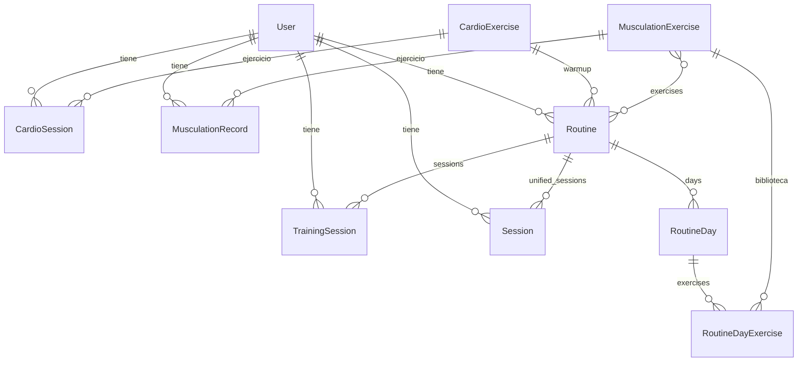
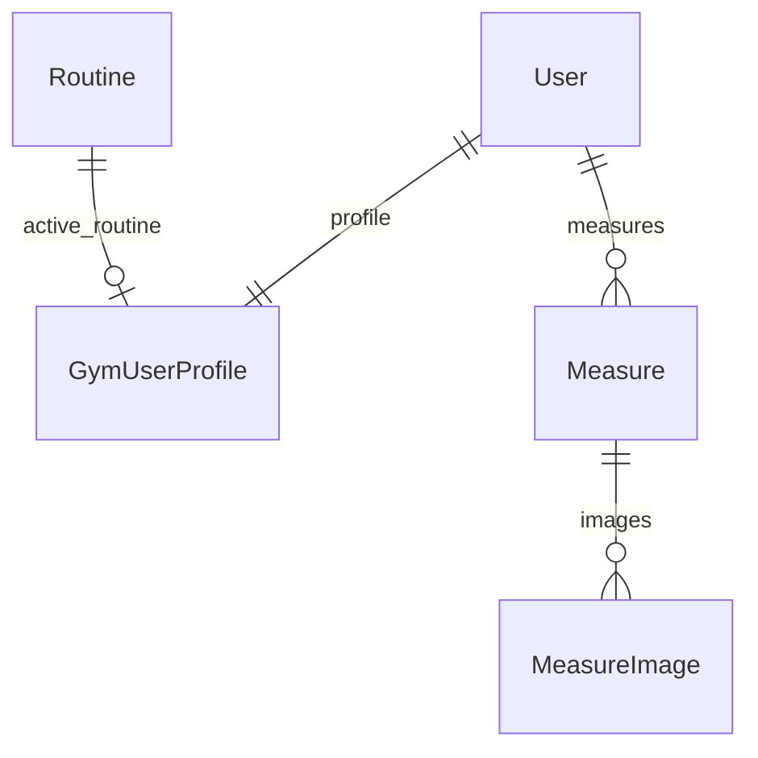
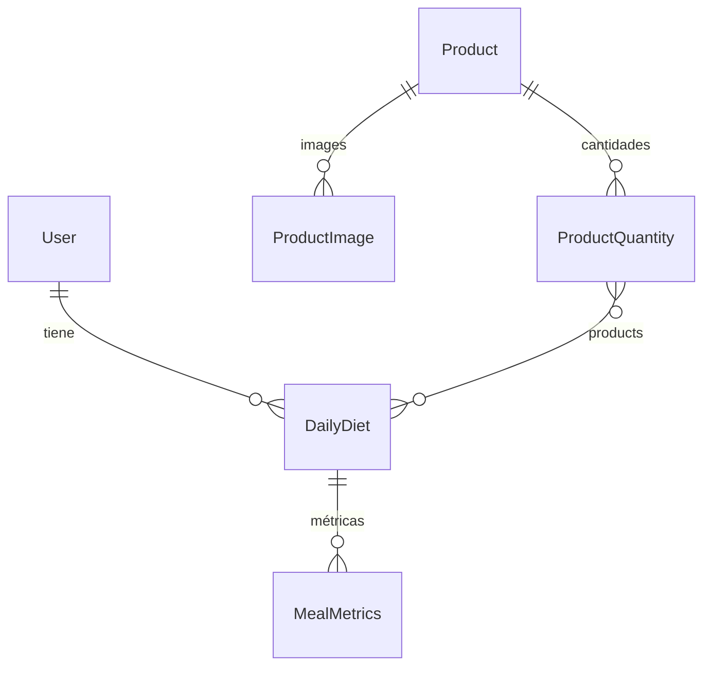
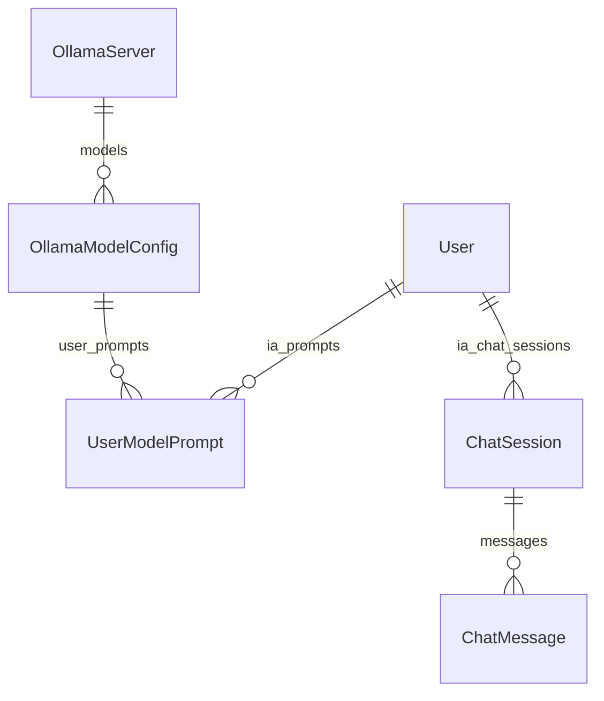

# Modelos Django — EvolveMe

Documentación generada a partir de los ficheros `models.py` de cada app instalada.

**Apps con modelos:** `gym`, `evolveme`, `nutrition`, `sleep`, `ia`  
**Apps sin modelos propios:** `cardio` (vacío; modelos en `gym`), `project`, `project_commands`, `csv`, `prompts`, `static`, `grafana`, `prometheus` (no existen `pictures` ni `screenshots` en el repositorio)

---

## gym

Modelos de cardio, musculación, rutinas y sesiones unificadas. Los modelos `CardioExercise` y `CardioSession` vivían en `cardio` y se movieron aquí.

### CardioExercise

Catálogo de ejercicios de cardio.

| Campo | Tipo | Relación / notas |
|-------|------|------------------|
| `name` | CharField(255) | choices: `CardioExerciseNameChoices` |
| `description` | TextField | null, blank |
| `image_base64` | TextField | null, blank |

**Relaciones:** ninguna FK saliente.  
**Relaciones inversas:** `CardioSession.exercise`, `Routine.warmup`

---

### CardioSession

Sesión de cardio de un usuario.

| Campo | Tipo | Relación / notas |
|-------|------|------------------|
| `user` | ForeignKey → `auth.User` | `related_name="cardio_sessions"`, CASCADE |
| `exercise` | ForeignKey → `CardioExercise` | `related_name="sessions"`, CASCADE, null, blank |
| `session_start` | DateTimeField | null, blank |
| `session_end` | DateTimeField | null, blank |
| `date` | DateField | |
| `location` | CharField(255) | null, blank |
| `workout_time` | DurationField | null, blank |
| `distance` | FloatField | km, null, blank |
| `avg_speed` | FloatField | km/h, null, blank |
| `active_calories` | IntegerField | null, blank |
| `total_calories` | IntegerField | null, blank |
| `elevation_gain` | IntegerField | m, null, blank |
| `average_heart_rate` | IntegerField | bpm, null, blank |
| `workout_image` | ImageField | `upload_to="cardio/%Y/%m/"`, null, blank |
| `created_at` | DateTimeField | auto_now_add |
| `updated_at` | DateTimeField | auto_now |

**Meta:** ordering `["-date", "-session_start"]`

---

### MusculationExercise

Catálogo de ejercicios de musculación.

| Campo | Tipo | Relación / notas |
|-------|------|------------------|
| `name` | CharField(255) | |
| `description` | TextField | null, blank |
| `body_part` | CharField(255) | choices: `BodyPartChoices`, null, blank |
| `sets` | IntegerField | |
| `reps` | IntegerField | |
| `unit` | CharField(255) | choices: `UnitChoices` |
| `image_base64` | TextField | null, blank |

**Relaciones inversas:** `MusculationRecord.exercise`, M2M `Routine.exercises`, `RoutineDayExercise.exercise`

---

### MusculationRecord

Registro de series/reps/peso de un usuario.

| Campo | Tipo | Relación / notas |
|-------|------|------------------|
| `user` | ForeignKey → `auth.User` | `related_name="musculation_records"`, CASCADE, null, blank |
| `exercise` | ForeignKey → `MusculationExercise` | `related_name="records"`, CASCADE |
| `sets` | IntegerField | |
| `reps` | IntegerField | |
| `weight` | IntegerField | kg |
| `tbi` | BooleanField | “To be improved” |
| `observation` | TextField | null, blank |
| `record_date` | DateTimeField | null, blank |
| `created_at` | DateTimeField | auto_now_add |
| `updated_at` | DateTimeField | auto_now |

---

### Routine

Rutina de entrenamiento de un usuario.

| Campo | Tipo | Relación / notas |
|-------|------|------------------|
| `user` | ForeignKey → `auth.User` | `related_name="routines"`, CASCADE, null, blank |
| `exercises` | ManyToManyField → `MusculationExercise` | `related_name="routines"` |
| `exercise_types` | JSONField | default `[]`, null, blank |
| `warmup` | ForeignKey → `CardioExercise` | `related_name="routines"`, CASCADE, null, blank |
| `warmup_duration` | DurationField | null, blank |
| `duration` | PositiveIntegerField | semanas, null, blank |
| `weekly_structure` | CharField(50) | choices: `RoutineSplitChoices`, null, blank |
| `training_focus` | CharField(50) | choices: `RoutineFocusChoices`, null, blank |
| `intensity_techniques` | JSONField | default `[]`, null, blank |
| `created_at` | DateTimeField | auto_now_add |
| `updated_at` | DateTimeField | auto_now |

**Relaciones inversas:** `RoutineDay.routine`, `TrainingSession.routine`, `Session.routine`, `GymUserProfile.active_routine`

**Meta:** ordering `["-created_at"]`

---

### RoutineDay

Día dentro de una rutina (entrenamiento o descanso).

| Campo | Tipo | Relación / notas |
|-------|------|------------------|
| `routine` | ForeignKey → `Routine` | `related_name="days"`, CASCADE |
| `day_number` | PositiveSmallIntegerField | |
| `name` | CharField(255) | enfoque del día |
| `is_rest` | BooleanField | default False |

**Meta:** `unique_together = [("routine", "day_number")]`, ordering `["day_number"]`

---

### RoutineDayExercise

Ejercicio asignado a un día de rutina.

| Campo | Tipo | Relación / notas |
|-------|------|------------------|
| `day` | ForeignKey → `RoutineDay` | `related_name="exercises"`, CASCADE |
| `exercise` | ForeignKey → `MusculationExercise` | `related_name="routine_day_exercises"`, SET_NULL, null, blank |
| `exercise_name` | CharField(255) | nombre libre |
| `sets_reps` | CharField(50) | ej. `4x8-10`, blank, default `""` |
| `notes` | CharField(255) | null, blank |
| `order` | PositiveSmallIntegerField | default 0 |

**Meta:** ordering `["order"]`

---

### TrainingSession

Sesión de entrenamiento de musculación.

| Campo | Tipo | Relación / notas |
|-------|------|------------------|
| `user` | ForeignKey → `auth.User` | `related_name="training_sessions"`, CASCADE, null, blank |
| `routine` | ForeignKey → `Routine` | `related_name="sessions"`, CASCADE, null, blank |
| `session_date` | DateTimeField | null, blank |
| `location` | CharField(255) | null, blank |
| `workout_time` | DurationField | null, blank |
| `active_kilocalories` | IntegerField | null, blank |
| `total_kilocalories` | IntegerField | null, blank |
| `avg_heart_rate` | IntegerField | BPM, null, blank |
| `workout_image` | ImageField | `upload_to="gym/%Y/%m/"`, null, blank |

---

### Session

Sesión unificada (cardio o gym).

| Campo | Tipo | Relación / notas |
|-------|------|------------------|
| `user` | ForeignKey → `auth.User` | `related_name="sessions"`, CASCADE, null, blank |
| `name` | CharField(255) | choices: `CardioExerciseNameChoices` (categoría) |
| `routine` | ForeignKey → `Routine` | `related_name="unified_sessions"`, SET_NULL, null, blank |
| `session_start` | DateTimeField | null, blank |
| `session_end` | DateTimeField | null, blank |
| `date` | DateField | |
| `location` | CharField(255) | null, blank |
| `workout_time` | DurationField | null, blank |
| `distance` | FloatField | km, null, blank |
| `avg_speed` | FloatField | km/h, null, blank |
| `active_calories` | IntegerField | null, blank |
| `total_calories` | IntegerField | null, blank |
| `elevation_gain` | IntegerField | m, null, blank |
| `average_heart_rate` | IntegerField | bpm, null, blank |
| `workout_image` | ImageField | `upload_to="sessions/%Y/%m/"`, null, blank |
| `created_at` | DateTimeField | auto_now_add |
| `updated_at` | DateTimeField | auto_now |

**Meta:** ordering `["-date", "-session_start"]`

---

### Diagrama de relaciones (gym)

---

## evolveme

Perfil de usuario, medidas corporales e imágenes de báscula.

### GymUserProfile

Perfil extendido del usuario de gym.

| Campo | Tipo | Relación / notas |
|-------|------|------------------|
| `user` | OneToOneField → `auth.User` | `related_name="profile"`, CASCADE |
| `birth_date` | DateField | null |
| `gender` | CharField(10) | choices: `GenderChoices`, null, blank |
| `height` | FloatField | cm, null, blank |
| `active_routine` | ForeignKey → `gym.Routine` | `related_name="active_routine"`, SET_NULL, null, blank |
| `start_date` | DateField | null, blank |
| `end_date` | DateField | null, blank |
| `objective` | CharField(255) | choices: `ObjectiveChoices`, null, blank |

---

### Measure

Registro antropométrico y de composición corporal.

| Campo | Tipo | Relación / notas |
|-------|------|------------------|
| `user` | ForeignKey → `auth.User` | `related_name="measures"`, CASCADE |
| `date` | DateField | |
| `weight` | FloatField | kg, null, blank |
| `arm` | FloatField | cm (flexionado), null, blank |
| `arm_relaxed` | FloatField | cm, null, blank |
| `chest` | FloatField | cm, null, blank |
| `waist` | FloatField | cm, null, blank |
| `leg` | FloatField | cm (flexionada), null, blank |
| `leg_relaxed` | FloatField | cm, null, blank |
| `fat_perc` | FloatField | %, null, blank |
| `muscle_mass` | FloatField | kg, null, blank |
| `bmi` | FloatField | null, blank |
| `body_water_mass` | FloatField | kg, null, blank |
| `body_water_percentage` | FloatField | %, null, blank |
| `fat_mass` | FloatField | kg, null, blank |
| `bone_mineral_content` | FloatField | kg, null, blank |
| `bone_mineral_percentage` | FloatField | %, null, blank |
| `protein_mass` | FloatField | kg, null, blank |
| `protein_percentage` | FloatField | %, null, blank |
| `muscle_percentage` | FloatField | %, null, blank |
| `skeletal_muscle_mass` | FloatField | kg, null, blank |
| `visceral_fat_rating` | FloatField | null, blank |
| `basal_metabolic_rate` | FloatField | Kcal, null, blank |
| `waist_to_hip_ratio` | FloatField | null, blank |
| `body_age` | IntegerField | años, null, blank |
| `fat_free_body_weight` | FloatField | kg, null, blank |

**Relaciones inversas:** `MeasureImage.measure`

---

### MeasureImage

Captura de báscula asociada a una medida.

| Campo | Tipo | Relación / notas |
|-------|------|------------------|
| `measure` | ForeignKey → `Measure` | `related_name="images"`, CASCADE |
| `image` | ImageField | `upload_to="evolveme/measures/%Y/%m/"` |
| `uploaded_at` | DateTimeField | auto_now_add |

---

### Diagrama de relaciones (evolveme)

---

## nutrition

Productos alimenticios, cantidades, dietas diarias y métricas agregadas.

### Product

Producto con valores nutricionales por 100 g.

| Campo | Tipo | Relación / notas |
|-------|------|------------------|
| `name` | CharField(255) | |
| `description` | TextField | blank |
| `barcode` | CharField(255) | null, blank |
| `market` | CharField(255) | choices: `MarketChoices`, blank |
| `energy_kj_per_100g` | FloatField | default 0, null, blank |
| `calories_per_100g` | FloatField | default 0 |
| `protein_per_100g` | FloatField | default 0 |
| `carbs_per_100g` | FloatField | default 0 |
| `fat_per_100g` | FloatField | default 0 |
| `saturated_fat_per_100g` | FloatField | default 0, null, blank |
| `monounsaturated_fat_per_100g` | FloatField | default 0, null, blank |
| `polyunsaturated_fat_per_100g` | FloatField | default 0, null, blank |
| `sugars_per_100g` | FloatField | default 0, null, blank |
| `polyols_per_100g` | FloatField | default 0, null, blank |
| `fiber_per_100g` | FloatField | default 0, null, blank |
| `salt_per_100g` | FloatField | default 0, null, blank |
| `omega3_epa_dha_per_100g` | FloatField | default 0, null, blank |
| `thiamine_b1_per_100g` | FloatField | mg, default 0, null, blank |
| `phosphorus_per_100g` | FloatField | mg, default 0, null, blank |
| `magnesium_per_100g` | FloatField | mg, default 0, null, blank |
| `iron_per_100g` | FloatField | mg, default 0, null, blank |
| `zinc_per_100g` | FloatField | mg, default 0, null, blank |
| `stock` | CharField(10) | choices: `StockChoices`, default `No` |
| `created_at` | DateTimeField | auto_now_add |
| `updated_at` | DateTimeField | auto_now |

**Meta:** `db_table = "food_products"`

**Relaciones inversas:** `ProductImage.product`, `ProductQuantity.product`

---

### ProductImage

Imagen del producto (etiqueta, envase).

| Campo | Tipo | Relación / notas |
|-------|------|------------------|
| `product` | ForeignKey → `Product` | `related_name="images"`, CASCADE |
| `image` | ImageField | `upload_to="nutrition/products/%Y/%m/"` |
| `created_at` | DateTimeField | auto_now_add |

---

### ProductQuantity

Cantidad ingerida de un producto.

| Campo | Tipo | Relación / notas |
|-------|------|------------------|
| `product` | ForeignKey → `Product` | CASCADE |
| `quantity` | FloatField | default 0 |
| `unit` | CharField(255) | blank |
| `created_at` | DateTimeField | auto_now_add |
| `updated_at` | DateTimeField | auto_now |

**Relaciones inversas:** M2M `DailyDiet.products`

---

### DailyDiet

Dieta de un día para un usuario.

| Campo | Tipo | Relación / notas |
|-------|------|------------------|
| `user` | ForeignKey → `auth.User` | CASCADE, null, blank |
| `date` | DateField | |
| `products` | ManyToManyField → `ProductQuantity` | |
| `created_at` | DateTimeField | auto_now_add |
| `updated_at` | DateTimeField | auto_now |

**Relaciones inversas:** `MealMetrics.daily_diet`

**Meta:** ordering `["-date"]`

---

### MealMetrics

Métricas nutricionales agregadas de una dieta diaria.

| Campo | Tipo | Relación / notas |
|-------|------|------------------|
| `daily_diet` | ForeignKey → `DailyDiet` | CASCADE |
| `calories` | FloatField | default 0 |
| `protein` | FloatField | default 0 |
| `carbs` | FloatField | default 0 |
| `fat` | FloatField | default 0 |
| `created_at` | DateTimeField | auto_now_add |
| `updated_at` | DateTimeField | auto_now |

---

### Diagrama de relaciones (nutrition)

---

## sleep

### SleepRecord

Registro de sueño por usuario y fecha.

| Campo | Tipo | Relación / notas |
|-------|------|------------------|
| `user` | ForeignKey → `auth.User` | `related_name="sleep_records"`, CASCADE |
| `date` | DateField | |
| `sleep_start` | DateTimeField | null, blank |
| `sleep_end` | DateTimeField | null, blank |
| `total_sleep_time` | DurationField | null, blank |
| `awake_time` | DurationField | null, blank |
| `rem_time` | DurationField | null, blank |
| `core_time` | DurationField | sueño ligero, null, blank |
| `deep_time` | DurationField | null, blank |
| `notes` | TextField | null, blank |
| `created_at` | DateTimeField | auto_now_add |
| `updated_at` | DateTimeField | auto_now |

**Meta:** `unique_together = [("user", "date")]`, ordering `["-date", "-sleep_start"]`

**Propiedad:** `total_seconds` — segundos de `total_sleep_time`

---

## ia

Clientes LLM, prompts, respuestas almacenadas, Ollama y chat.

### LLMClient

| Campo | Tipo | Relación / notas |
|-------|------|------------------|
| `name` | CharField(255) | |
| `url` | URLField | |
| `api_key` | CharField(255) | |
| `status` | BooleanField | default True |
| `created_at` | DateTimeField | auto_now_add |
| `updated_at` | DateTimeField | auto_now |

---

### Promtps

Plantillas de prompt (nombre con typo histórico: `Promtps`).

| Campo | Tipo | Relación / notas |
|-------|------|------------------|
| `name` | CharField(255) | |
| `prompt` | TextField | |
| `created_at` | DateTimeField | auto_now_add |
| `updated_at` | DateTimeField | auto_now |

---

### GymLLMResponse

| Campo | Tipo | Relación / notas |
|-------|------|------------------|
| `response` | TextField | |
| `stored` | BooleanField | default False |
| `created_at` | DateTimeField | auto_now_add |
| `updated_at` | DateTimeField | auto_now |

---

### NutritionLLMResponse

| Campo | Tipo | Relación / notas |
|-------|------|------------------|
| `response` | TextField | |
| `stored` | BooleanField | default False |
| `created_at` | DateTimeField | auto_now_add |
| `updated_at` | DateTimeField | auto_now |

---

### ProductLLMResponse

| Campo | Tipo | Relación / notas |
|-------|------|------------------|
| `products` | JSONField | |
| `created_at` | DateTimeField | auto_now_add |
| `updated_at` | DateTimeField | auto_now |

---

### OllamaServer

Configuración de instancia Ollama.

| Campo | Tipo | Relación / notas |
|-------|------|------------------|
| `name` | CharField(100) | unique |
| `base_url` | URLField | |
| `enabled` | BooleanField | default True |
| `api_key` | CharField(255) | blank |
| `created_at` | DateTimeField | auto_now_add |
| `updated_at` | DateTimeField | auto_now |

**Relaciones inversas:** `OllamaModelConfig.server`

---

### OllamaModelConfig

Modelo concreto en un servidor Ollama.

| Campo | Tipo | Relación / notas |
|-------|------|------------------|
| `server` | ForeignKey → `OllamaServer` | `related_name="models"`, CASCADE |
| `model_name` | CharField(100) | nombre en Ollama |
| `temperature` | FloatField | default 0.7 |
| `top_p` | FloatField | default 0.9 |
| `max_tokens` | PositiveIntegerField | default 512 |
| `alias` | CharField(100) | nombre lógico en la app |
| `description` | TextField | blank |
| `is_default` | BooleanField | default False |
| `deprecated` | BooleanField | default False |
| `deprecated_at` | DateTimeField | null, blank |
| `proposito` | CharField(255) | blank |
| `downloaded` | BooleanField | default False |
| `digest` | CharField(64) | blank |
| `last_checked_at` | DateTimeField | null, blank |
| `update_available` | BooleanField | default False |
| `pull_progress` | IntegerField | 0–100, null, blank |
| `created_at` | DateTimeField | auto_now_add |
| `updated_at` | DateTimeField | auto_now |

**Meta:** `unique_together = ("server", "model_name")`  
**Propiedad:** `is_deprecated` — `deprecated` o `deprecated_at` no nulo

**Relaciones inversas:** `UserModelPrompt.model_config`

---

### UserModelPrompt

Prompt de sistema por usuario y modelo.

| Campo | Tipo | Relación / notas |
|-------|------|------------------|
| `user` | ForeignKey → `AUTH_USER_MODEL` | `related_name="ia_prompts"`, CASCADE |
| `model_config` | ForeignKey → `OllamaModelConfig` | `related_name="user_prompts"`, CASCADE |
| `prompt_text` | TextField | |
| `generated_at` | DateTimeField | auto_now |

**Meta:** `unique_together = ("user", "model_config")`

---

### ChatSession

Hilo de conversación con un modelo.

| Campo | Tipo | Relación / notas |
|-------|------|------------------|
| `user` | ForeignKey → `AUTH_USER_MODEL` | `related_name="ia_chat_sessions"`, CASCADE |
| `model_key` | CharField(200) | blank, ej. `local\|llama3.1:8b-q4_K_M` |
| `created_at` | DateTimeField | auto_now_add |
| `updated_at` | DateTimeField | auto_now |

**Relaciones inversas:** `ChatMessage.session`

**Meta:** ordering `["-updated_at"]`

---

### ChatMessage

Mensaje dentro de una sesión de chat.

| Campo | Tipo | Relación / notas |
|-------|------|------------------|
| `session` | ForeignKey → `ChatSession` | `related_name="messages"`, CASCADE |
| `role` | CharField(20) | choices: `user` \| `assistant` |
| `content` | TextField | |
| `created_at` | DateTimeField | auto_now_add |

**Meta:** ordering `["created_at"]`

---

### Diagrama de relaciones (ia)

---

## cardio

**Sin modelos.** `cardio/models.py` está vacío; `CardioExercise` y `CardioSession` están en `gym.models`. La app se mantiene por migraciones históricas.

---

## Apps referenciadas sin modelos Django

| App / carpeta | Contenido |
|---------------|-----------|
| `project` | Settings, URLs, Celery, templates |
| `project_commands` | Comandos de gestión (`import_data`, `drop_data`, `initsetup`, `update_data`) |
| `csv` | Ficheros CSV de importación (`products.csv`, `measures.csv`, etc.) |
| `prompts` | Ficheros `.txt` de prompts (`gym.txt`, `nutrition.txt`, …) |
| `static` | CSS/JS estáticos |
| `grafana` | Provisioning de dashboards y datasources |
| `prometheus` | Configuración de Prometheus |
| `pictures` | No existe en el repositorio |
| `screenshots` | No existe en el repositorio |

---

## Resumen global

| App | Modelos | Total |
|-----|---------|-------|
| **gym** | CardioExercise, CardioSession, MusculationExercise, MusculationRecord, Routine, RoutineDay, RoutineDayExercise, TrainingSession, Session | 9 |
| **evolveme** | GymUserProfile, Measure, MeasureImage | 3 |
| **nutrition** | Product, ProductImage, ProductQuantity, DailyDiet, MealMetrics | 5 |
| **sleep** | SleepRecord | 1 |
| **ia** | LLMClient, Promtps, GymLLMResponse, NutritionLLMResponse, ProductLLMResponse, OllamaServer, OllamaModelConfig, UserModelPrompt, ChatSession, ChatMessage | 10 |
| **cardio** | — | 0 |
| **Total proyecto** | | **28** |

### Dependencias entre apps

- `evolveme` → `gym.Routine` (FK en `GymUserProfile`)
- `gym`, `evolveme`, `nutrition`, `sleep`, `ia` → `django.contrib.auth.models.User` (o `AUTH_USER_MODEL`)
- El resto de relaciones son intra-app o hacia `User`
